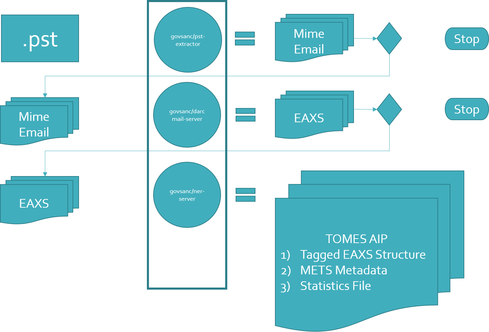

## Introduction

This repository contains a complete docker application, which for simplicity, we will refer to this
repository as the TOMES application.

The TOMES project, and this repository, is built out of a few different stand alone applications that have been compiled
into a complete docker application.

Repository | Purpose
---------- | --------
[pst-extractor](https://github.com/StateArchivesOfNorthCarolina/pst-extractor) | This program can be used to extract Mime emails from an PST file.
[DarcMailCLI](https://github.com/StateArchivesOfNorthCarolina/DarcMailCLI) | Converts Mime Email to EAXS representation
[tomes-tool](https://github.com/StateArchivesOfNorthCarolina/tomes_tool) | Uses Stanford CoreNLP to tag the emails in the EAXS file using either standard or custom tagging schemas

##Dataflow Model

